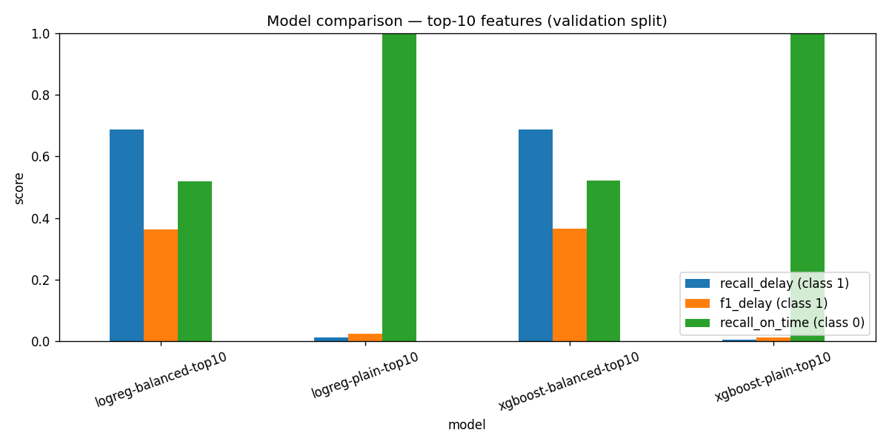
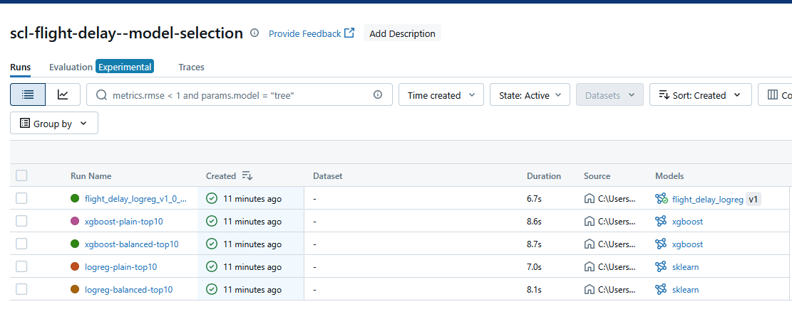
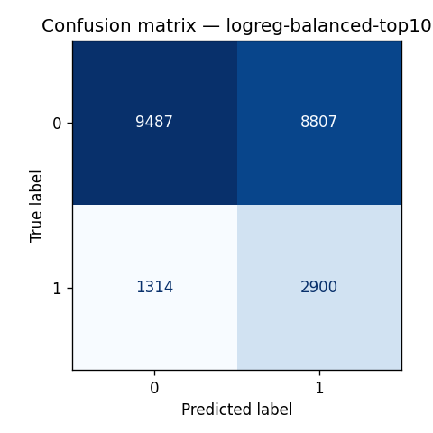

# Challenge documentation — Software Engineer (ML & LLMs)

This document records the decisions, fixes and rationale behind operationalizing
the Data Scientist's flight-delay model. It is organized by the four challenge
parts, followed by an **Architecture Decision Record (ADR)** log.

## Working method

- **GitFlow** branching: feature branches `feature/lt-mle-0XX-<slug>` are merged
  via Pull/Merge Requests; development branches are preserved (never deleted).
- Work is tracked as sequential tickets (`LT-MLE-001` … `LT-MLE-007`), each with
  a branch, an MR and acceptance criteria.
- Tooling: **uv** (env + lockfile), **ruff** (lint/format), **Python 3.10**.
- The provided `requirements*.txt` are preserved as the canonical install used by
  the Makefile targets and the Docker image.

---

## Part I — Model

### Transcription & bug fixes
The notebook (`exploration.ipynb`) was transcribed into `challenge/model.py` as a
`DelayModel` class with `preprocess` / `fit` / `predict`. Fixes and good
practices applied:

- **Skeleton bug**: the provided return annotation `Union(Tuple[...], pd.DataFrame)`
  (a runtime `TypeError`) was corrected to valid typing.
- **Feature construction is deterministic**: features are one-hot encoded from
  `OPERA`, `TIPOVUELO`, `MES` and then **reindexed to the fixed top-10 feature
  set** (`fill_value=0`). The same code path therefore works for training (full
  dataset) and for serving a single flight that only activates a couple of
  categories — avoiding the classic "missing dummy column at inference" bug.
- **Target** is computed as `delay = 1 if min_diff > 15 else 0`, returned as a
  one-column DataFrame when `target_column` is provided.
- **Persistence**: the fitted estimator is saved with `joblib` and loaded in
  `__init__`, so `predict` works on a fresh instance (and the API serves
  immediately at start-up).

> Notebook bugs noted: the `sns.barplot` calls pass positional `x, y` arrays
> (deprecated/raises in modern seaborn) and the EDA `get_rate_from_column`
> computes `total/delays` (inverted ratio). These are EDA-only cells and do not
> affect the productive model, so they were left in the notebook and simply not
> carried over.

### Model selection (data-driven)
The DS proposed XGBoost and LogisticRegression and concluded the choice between
them was open. Instead of guessing, we **reproduced the comparison under MLflow
tracking** (`challenge/train.py`): both algorithms, on the **top-10 features**,
**with and without class balancing**, using the same `train_test_split`
(`test_size=0.33`, `random_state=42`). No hyper-parameter tuning was performed —
the challenge explicitly does not ask for model improvements.

**Validation results (top-10 features):**

| run | recall (delay·1) | f1 (delay·1) | ROC-AUC | PR-AUC | model size | fit time |
|---|---|---|---|---|---|---|
| `logreg-balanced-top10`  | **0.688** | 0.364 | 0.640 | 0.283 | **0.96 KB** | 0.07 s |
| `xgboost-balanced-top10` | 0.688 | 0.366 | 0.643 | 0.286 | 250 KB | 0.29 s |
| `logreg-plain-top10`     | 0.013 | 0.025 | 0.640 | 0.282 | 0.95 KB | 0.06 s |
| `xgboost-plain-top10`    | 0.006 | 0.012 | 0.642 | 0.287 | 241 KB | 0.21 s |

**Figure 1 — Per-class scores across the four candidates.** The two balanced
models tie on the delay class; the unbalanced models flatline.



**Figure 2 — MLflow tracking UI** for the `scl-flight-delay--model-selection`
experiment, showing the four runs, their logged metrics, and the registered
champion (`flight_delay_logreg` v1.0.0 `@champion`).



**Figure 3 — Champion confusion matrix** (`logreg-balanced`, validation split):
class balancing recovers the majority of delayed flights (high class-1 recall) at
the cost of some false positives — the right trade-off for a delay-warning tool.



**Findings (which confirm the DS's conclusions):**
- Without balancing, both models collapse to predicting "on-time" almost always
  (recall on the delay class ≈ 0) — useless for the airport team's purpose.
- With balancing, both lift delay-recall to **0.688**.
- **LogisticRegression ≈ XGBoost** on every quality metric — including the
  threshold-independent **ROC-AUC (0.640 vs 0.643)** and **PR-AUC (0.283 vs
  0.286)** — so the comparison does not hinge on a particular decision threshold.

**Decision:** the two balanced models are statistically indistinguishable in
quality, but LogisticRegression is **~260× smaller** (0.96 KB vs 250 KB) and
**~4× faster to train**. We therefore pick the lighter, fully interpretable
`LogisticRegression(class_weight='balanced')`
(see [ADR-001](#adr-001--production-model-choice)).

### Experiment tracking & model versioning
- Runs, params, per-class metrics, confusion matrices and the fitted models are
  logged to a **local MLflow** store (`sqlite:///mlflow.db`), experiment
  **`scl-flight-delay--model-selection`**.
- The champion is **registered** following the MLOps naming convention
  `{domain}_{model_type}` → **`flight_delay_logreg`**, with the lifecycle stage
  applied as an **alias** (`@champion`) rather than baked into the name, the
  **semantic version `1.0.0`** as a tag, and traceability tags (`git_commit`,
  `dataset_md5`, `dataset_rows`, `feature_set`). It is exported to
  `challenge/model.joblib` (the exact artifact the API serves). See
  [ADR-006](#adr-006--model-naming--registry-convention).
- Reproduce / inspect:
  ```bash
  uv run python -m challenge.train
  uvx --from "mlflow==2.22.5" mlflow ui --backend-store-uri sqlite:///mlflow.db
  ```

### Tests
`make model-test` → **4 passed**, coverage 92%.

---

## Part II — API

The model is served with **FastAPI** (`challenge/api.py`):

- `GET /health` → `{"status": "OK"}` (liveness probe).
- `POST /predict` accepts a batch:
  ```json
  { "flights": [ { "OPERA": "Grupo LATAM", "TIPOVUELO": "N", "MES": 3 } ] }
  ```
  and returns `{ "predict": [0] }`.

**Input validation** uses Pydantic models with field validators:
- `MES` ∈ 1..12,
- `TIPOVUELO` ∈ {`I`, `N`},
- `OPERA` ∈ the 23 airlines seen in training (`KNOWN_OPERA`).

Any invalid field returns **HTTP 400**. FastAPI/Pydantic raise `422` by default, so
a `RequestValidationError` handler maps validation failures to `400`, as the tests
require.

The `DelayModel` is instantiated once at start-up and loads `challenge/model.joblib`,
so the API serves immediately without retraining. Requests are turned into the
fixed 10-feature frame via `DelayModel.preprocess` and scored with `predict`.

**Tests:** `make api-test` → **4 passed** (the valid case plus the three 400 cases).

## Part III — Cloud deployment

The API is containerized and deployed to **GCP Cloud Run** via **Terraform**
(`infrastructure/`), with the actual rollout driven by the CD pipeline (Part IV).

### Container
- `Dockerfile`: `python:3.10-slim`, installs **only** `requirements.txt` (no
  mlflow/xgboost/ruff) for a lean image and fast cold-starts, runs as a non-root
  user, and binds uvicorn to Cloud Run's `$PORT`. A `.dockerignore` keeps the
  notebook, training script, tests and docs out of the image.
- Verified locally: `docker build` + `docker run` → `/health` and `/predict`
  return 200 with correct predictions.

### Rate limiting & safety
- Per-IP rate limiting via **slowapi**, configured by the `RATE_LIMIT` env var
  (e.g. `120/minute`). It is **disabled by default** so `make stress-test` can
  saturate the API; the real overload/cost guardrail is Cloud Run
  `max_instances` (plus `min_instances = 0` to scale to zero when idle).

### Infrastructure as code (`infrastructure/`)
Terraform provisions: Artifact Registry (Docker), a least-privilege **runtime
service account**, a **deployer service account**, and **Workload Identity
Federation** so GitHub Actions authenticates **keylessly** (no SA-key secret).
Remote state lives in GCS. The Cloud Run service is public
(`allUsers` → `roles/run.invoker`) so the airport team and the stress test can
reach it. See `infrastructure/README.md` for the one-time bootstrap and the list
of GitHub secrets. See [ADR-002](#adr-002--cloud-platform).

### Deployment & stress test
The API is **live** at:

> **https://flight-delay-api-n7kpplta7a-uc.a.run.app**

This URL is set in `Makefile` line 26 (`STRESS_URL`). `make stress-test`
(Locust, 100 users, 60 s) against the live service:

| metric | value |
|---|---|
| requests | 8,915 |
| failures | 1 (**0.01 %**) — a single cold-start 500 |
| median / avg | 170 ms / 197 ms |
| p95 / p99 | 290 ms / 390 ms |
| throughput | ~150 req/s |

Cloud Run autoscaled within `max_instances` and absorbed the load with a
negligible error rate. (`locust 1.6` requires the pre-2.1 Flask stack, pinned in
`requirements-test.txt` so the target runs on current package indexes.)

## Part IV — CI/CD

Two GitHub Actions workflows under `.github/workflows/`:

### `ci.yml` — Continuous Integration
Runs on pushes/PRs to `main`/`develop`:
1. Install **uv** (Python 3.10) and the runtime + test dependencies.
2. **Lint** with `ruff check challenge`.
3. **`make model-test`** and **`make api-test`** (the same targets graders use).
4. Upload the coverage report as an artifact.

### `cd.yml` — Continuous Delivery
Runs on push to `main` (and `workflow_dispatch`), in the protected `production`
GitHub environment:
1. **Authenticate to GCP keylessly** via Workload Identity Federation
   (`permissions: id-token: write`) — no service-account key.
2. **Build & push** the image to Artifact Registry, tagged with the commit SHA.
3. **`terraform apply -refresh=false`** to roll the new image onto the existing
   Cloud Run service. `-refresh=false` keeps it a single, image-only change so the
   deployer SA needs only `run.admin` + `serviceAccountUser` (it cannot modify
   IAM/WIF/SAs — least privilege; see [ADR-003](#adr-003--secrets--cd-authentication)).
4. Publish the live Cloud Run URL to the job summary.

### Required GitHub secrets (set in the `production` environment)
`GCP_PROJECT_ID`, `GCP_REGION`, `GCP_WORKLOAD_IDENTITY_PROVIDER`, `GCP_DEPLOYER_SA`,
`TF_STATE_BUCKET` — all produced by the Terraform bootstrap (see
`infrastructure/README.md`). WIF is keyless, so none is a credential file.

### One extra grant for CD
Because the Terraform **state bucket** is created out-of-band (not managed by the
config), grant the deployer SA access to it once:
```bash
gcloud storage buckets add-iam-policy-binding gs://TF_STATE_BUCKET \
  --member="serviceAccount:DEPLOYER_SA_EMAIL" \
  --role="roles/storage.objectAdmin"
```

After the first successful deploy, the Cloud Run URL is placed in `Makefile`
line 26 (`STRESS_URL`) so `make stress-test` runs against the live service.

---

## Architecture Decision Record (ADR) log

Each ADR follows the lightweight **Michael Nygard template** — *Status, Context,
Decision* (present tense), *Consequences* (positive, trade-offs, and what would
trigger a re-evaluation).

### ADR-001 — Production model choice
- **Status:** Accepted
- **Context:** Part I. The DS trained XGBoost and LogisticRegression and left the
  choice open. We need one production model that meets the test thresholds and is
  cheap to serve.
- **Decision:** We use **`LogisticRegression(class_weight='balanced')`** on the
  top-10 features as the champion.
- **Consequences:**
  - *Positive:* equal quality to XGBoost on the validation split (delay-class f1
    0.364 vs 0.366; ROC-AUC 0.640 vs 0.643) but **~260× smaller** and **~4×
    faster**, fully interpretable via coefficients, and no XGBoost in the serving
    image (smaller, faster cold-starts, fewer deps to secure).
  - *Trade-off:* a linear model can't capture non-linear interactions a boosted
    tree might; XGBoost stays a dev-only dependency for the comparison.
  - *Re-evaluate if:* new data/features make XGBoost materially better — swapping
    the champion is a one-line change via the registry + `train.py`.

### ADR-002 — Cloud platform
- **Status:** Accepted
- **Context:** Part III. The API must stay live ~1 week for low-traffic review,
  cheaply and with minimal ops.
- **Decision:** We deploy on **GCP Cloud Run**, provisioned with **Terraform**.
- **Consequences:**
  - *Positive:* pay-per-use with **scale-to-zero** (cheapest for intermittent
    traffic vs a 24/7 VM); managed HTTPS + autoscaling; Terraform makes the env
    reproducible and is reused by CD.
  - *Trade-off:* cold-start latency on the first request after idle; a
    per-request execution model (no long-lived background work).
  - *Re-evaluate if:* traffic becomes steady/high (a VM or higher `min_instances`
    may be cheaper) or cold-starts hurt UX → raise `min_instances`.

### ADR-003 — Secrets & CD authentication
- **Status:** Accepted
- **Context:** Part IV. CD must authenticate to GCP from GitHub Actions in a
  **public** repo without leaking long-lived credentials.
- **Decision:** We authenticate via **Workload Identity Federation** (OIDC)
  impersonating a least-privilege **deployer** SA, with the provider restricted to
  this repository, and run `terraform apply -refresh=false` (image-only). **No
  SA key** is stored.
- **Consequences:**
  - *Positive:* no long-lived key to leak; the deployer SA is limited to
    `run.admin` + `iam.serviceAccountUser` + `artifactregistry.writer` (+ state
    bucket access) and **cannot** alter IAM/WIF/SAs; non-secret config is passed
    via Actions secrets, nothing committed.
  - *Trade-off:* a one-time owner bootstrap apply must create WIF before CD works;
    `-refresh=false` can mask drift in non-image resources.
  - *Re-evaluate if:* more infra must change via CD → split into an owner-applied
    `bootstrap` module and a CD-applied `service` module. A SA-key JSON
    (`GCP_SA_KEY`) is the documented fallback only if WIF is unavailable.

### ADR-004 — Toolchain: Python 3.10 + uv + ruff
- **Status:** Accepted
- **Context:** The provided pins (pandas 1.3.5, numpy 1.22.4, scikit-learn 1.3.0,
  pydantic v1) constrain the interpreter; we want reproducible envs + linting
  without breaking the grader make targets.
- **Decision:** We pin **Python 3.10** (`.python-version`), manage environments
  with **uv** (+ `uv.lock`), and lint/format with **ruff**; the `requirements*.txt`
  files remain the canonical install.
- **Consequences:**
  - *Positive:* reproducible, fast installs; consistent lint/format; existing make
    targets unchanged.
  - *Trade-off:* minor duplication between `pyproject.toml` and `requirements*.txt`;
    a few compatibility pins are needed (`anyio<4` for pytest 6.2.5, `Jinja2<3.1`
    for locust 1.6).
  - *Re-evaluate if:* the dependency pins are modernized — we could move to a newer
    Python and drop the compatibility pins.

### ADR-005 — Experiment tracking: local MLflow + semantic versioning
- **Status:** Accepted
- **Context:** Part I needs auditable model selection and versioning for a single
  model, without standing infrastructure.
- **Decision:** We use a **local sqlite-backed MLflow** store for run comparison,
  plots and a model registry with semantic versions + aliases; MLflow is
  **dev-only**.
- **Consequences:**
  - *Positive:* reproducible comparison + registry at zero hosting cost; not
    shipped in the serving image.
  - *Trade-off:* the local store isn't shared across machines/CI.
  - *Re-evaluate if:* multiple people/pipelines need shared history → host a
    tracking server with a database backend.

### ADR-006 — Model naming & registry convention
- **Status:** Accepted
- **Context:** Production models need names that convey family/version/stage and
  avoid ambiguity during A/B testing and rollback.
- **Decision:** We name models
  `{domain}_{model_type}_v{MAJOR}_{MINOR}_{PATCH}_{stage}` (e.g.
  `flight_delay_logreg_v1_0_0_champion`); in the registry the name is **decoupled
  from the stage** (register `flight_delay_logreg`, SemVer as a tag, lifecycle
  stage as an **alias** `@champion`/`@challenger`); traceability (git commit,
  dataset hash, rows, feature set) is stored as tags.
- **Consequences:**
  - *Positive:* status visible at a glance; safe A/B + rollback via aliases; CD can
    auto-bump the patch without renaming artifacts; captured as a reusable skill
    (`.claude/skills/mlops-model-naming`).
  - *Trade-off:* relies on tooling/discipline to keep tags + alias in sync with
    `challenge/model.joblib`.
  - *Re-evaluate if:* adopting a managed registry (e.g. Vertex AI Model Registry)
    with its own conventions.

---

## Submission

| | |
|---|---|
| Name | Braulio Otavalo |
| Repository | https://github.com/beotavalo/latam-challenge-mle (public) |
| Live API | https://flight-delay-api-n7kpplta7a-uc.a.run.app |
| Part I (model) | `make model-test` ✅ — LogisticRegression champion, MLflow-tracked |
| Part II (API) | `make api-test` ✅ — FastAPI with 400-on-invalid validation |
| Part III (deploy) | Cloud Run via Terraform ✅ — `make stress-test` 0.01% errors |
| Part IV (CI/CD) | GitHub Actions CI + WIF-authenticated Terraform CD ✅ |

The challenge is submitted **once** via `POST` to
`https://advana-challenge-check-api-cr-k4hdbggvoq-uc.a.run.app/software-engineer`
with the name, mail, `github_url` and `api_url` above, expecting
`{"status": "OK", "detail": "your request was received"}`.
